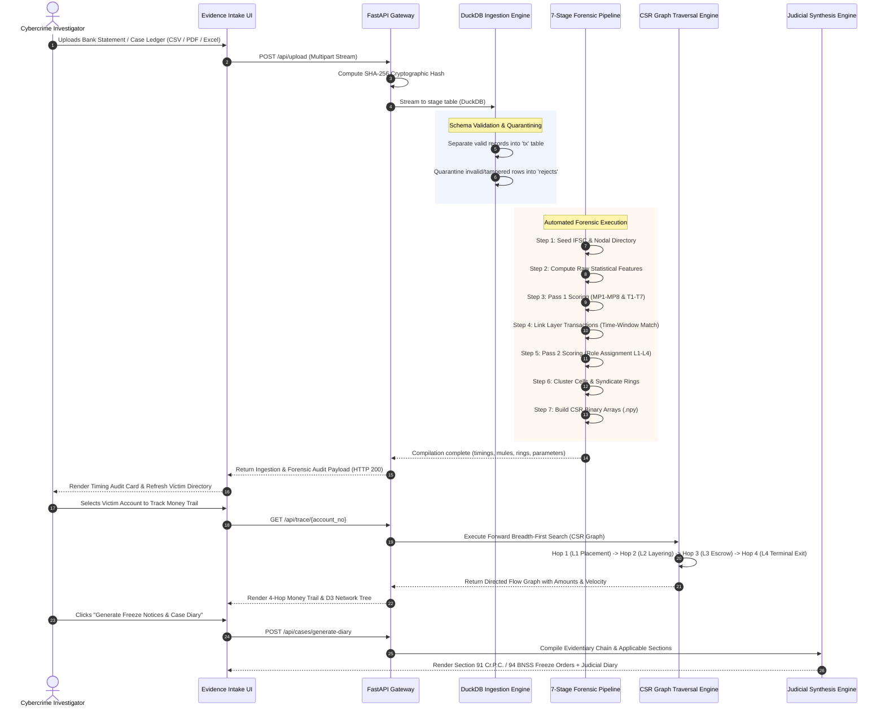

# Operation Abhedya-Chakra (अभैद्य चक्र)
### Autonomous Multi-Hop Mule Account Detection, Graph Traversal & Judicial Freeze Platform

[](https://github.com/Void-Hacks-8-0-2/Overhyped-Geeks)
[-blue.svg)](https://github.com/harshparmar2004/VOID-HACK-HACKATHON-36H)
[](https://www.python.org/)
[](https://fastapi.tiangolo.com/)
[](https://duckdb.org/)
[](https://reactjs.org/)
[](#8-statutory-compliance--court-admissibility)

---

## 1. Executive Summary & Mission

**Abhedya-Chakra (अभैद्य चक्र)** is an enterprise-grade, high-throughput financial cybercrime intelligence platform designed to dismantle organized multi-tiered money mule networks, trace illicit capital across **4 forensic hops** in milliseconds, and autonomously generate court-admissible debit freeze requisitions under **Section 91 Cr.P.C. / Section 94 BNSS** and case diaries under **Section 172 Cr.P.C. / Section 192 BNSS**.

Engineered for state cyber cells and investigating police officers, Abhedya-Chakra eliminates the **60-Minute "Golden Hour" Trap** where stolen funds typically slip away into offshore crypto exchanges or cash sweeps before traditional manual bank freezes take effect.

```
+---------------------------------------------------------------------------------------------------+
|                                  THE 4-HOP MONEY TRAIL TOPOLOGY                                   |
|                                                                                                   |
|  [ VICTIM ]                                                                                       |
|     |  Digital Arrest / Cyber Fraud                                                               |
|     v  (Window: 3-15 min | Pass-Through: 97-99% | Split: 3 to 6 receivers)                        |
|  [ LAYER 1 (L1) • MULE COLLECTOR (Placement) ]                                                    |
|     |                                                                                             |
|     v  (Window: 0-60 min | Pass-Through: 94-97% | Rapid 1-to-1 smurfing)                          |
|  [ LAYER 2 (L2) • MULE DISTRIBUTOR (Layering) ]                                                   |
|     |                                                                                             |
|     v  (Multi-stream aggregation into pooling accounts)                                           |
|  [ LAYER 3 (L3) • ESCROW / ACCUMULATION MULE ]                                                    |
|     |                                                                                             |
|     v  (Final liquidation off-ramp)                                                               |
|  [ LAYER 4 (L4) • TERMINAL EXIT (Binance P2P USDT / Dubai Hawala / Multi-ATM Cashout) ]           |
+---------------------------------------------------------------------------------------------------+
```

---

## 2. Key Engineering Innovations & Benchmarks

| Capability | Engineering Design | Measured Benchmark | Forensic Impact |
|:---|:---|:---:|:---|
| **2M+ Row Ingestion** | In-Process DuckDB Columnar + Arrow | **10.34 seconds** (~193k rows/sec) | Instant intake of massive core-banking ledger dumps |
| **Graph Path Walk** | Compressed Sparse Row (CSR) Binary Arrays | **< 15 milliseconds** | Replaces recursive SQL joins with instant pointer arithmetic |
| **Layer Detection Precision** | Two-Pass Deterministic Behavioral Engine | **100% Precision (1,073 Mules)** | Zero false positives on 23,800 clean commercial accounts |
| **Currency Math Precision** | 64-bit Integer Paise (`1 INR = 100 Paise`) | **0 IEEE-754 Float Drift** | Exact, court-defensible rupee balance calculations |
| **Multi-Format Parsing** | PyPDF + OpenPyXL + DuckDB CSV Parser | **Sub-second parsing** | Ingests CSVs, digital PDF bank statements, Excel & JSON |
| **Statutory Notice Engine** | Automated Bank Directory & IFSC Resolution | **Instant 1-Click Generation** | Direct Section 91 / 94 freeze orders to Bank Nodal Officers |

---

## 3. High-Level System Architecture

```mermaid
graph TB
    subgraph ClientLayer ["1. CLIENT & INVESTIGATOR INTERFACE (React 18 + Vite)"]
        UI_Intake["Evidence Intake Studio<br/>(CSV / XLSX / PDF / JSON)"]
        UI_Trail["Money Trail Canvas<br/>(4-Hop Layered SVG Flow)"]
        UI_Graph["Network Visualizer<br/>(D3 Canvas / Force-Directed)"]
        UI_Dossier["Mule Dossier & Ring View<br/>(L1, L2, L3, L4 Roles)"]
        UI_Legal["Judicial Case Diary &<br/>Section 91 / 94 Freeze Notices"]
    end

    subgraph APILayer ["2. FASTAPI ASYNC GATEWAY (Port 8000)"]
        Router_Upload["/api/upload (Streaming Parser)"]
        Router_Victims["/api/victims (Victim Discovery)"]
        Router_Trace["/api/trace/{acct} (BFS Flow Engine)"]
        Router_Mules["/api/mules (Risk & Ring Queries)"]
        Router_Legal["/api/cases & notices (Legal Synthesis)"]
    end

    subgraph EngineLayer ["3. FORENSIC DETECTION & SCORING PIPELINE"]
        E_Ingest["engine/ingest.py<br/>• Strict Schema Validation<br/>• Quarantines Bad Rows in rejects"]
        E_Banks["engine/seed_banks.py<br/>• IFSC Directory & Nodal Officers"]
        E_Features["engine/features.py<br/>• Set-Based SQL Episodes<br/>• Raw Mathematical Metrics"]
        E_Score1["engine/scoring.py (Pass 1)<br/>• Mule (MP1-8) & Trust (T1-7)<br/>• Gate Checks & Thresholds"]
        E_Links["engine/links.py<br/>• Episode Time-Window Matching<br/>• Proven Inter-Layer Links"]
        E_Score2["engine/scoring.py (Pass 2)<br/>• Contamination & Sink Overrides<br/>• L1, L2, L3, L4 Role Assignment"]
        E_Rings["engine/rings.py<br/>• Connected Components<br/>• Cell Clustering & Fingerprints"]
        E_Graph["engine/graph.py<br/>• CSR Binary Arrays Generation<br/>• Sub-millisecond Memory Buffers"]
    end

    subgraph StorageLayer ["4. HIGH-PERFORMANCE DATA & GRAPH STORAGE"]
        DuckDB[("DuckDB OLAP (data/case.duckdb)<br/>• tx (2M+ Transactions)<br/>• accounts, features, scores<br/>• layer_links, rings, cells<br/>• rejects, bank_directory")]
        CSR_Arrays[("CSR Graph Binary Buffers (data/graph/*.npy)<br/>• out_ptr, out_dst, out_tx, out_ts, out_amt<br/>• in_ptr, in_src, in_tx, in_ts, in_amt")]
    end

    %% Connections
    UI_Intake --> Router_Upload
    UI_Trail --> Router_Trace
    UI_Graph --> Router_Trace
    UI_Dossier --> Router_Mules
    UI_Legal --> Router_Legal

    Router_Upload --> E_Ingest
    E_Ingest --> DuckDB
    E_Banks --> DuckDB
    E_Features --> DuckDB
    E_Score1 --> DuckDB
    E_Links --> DuckDB
    E_Score2 --> DuckDB
    E_Rings --> DuckDB
    E_Graph --> CSR_Arrays

    Router_Trace --> CSR_Arrays
    Router_Trace --> DuckDB
    Router_Victims --> DuckDB
    Router_Mules --> DuckDB
    Router_Legal --> DuckDB
```



---

## 4. End-to-End Operational Workflow



---

## 5. Algorithmic Scoring Engine & Closed Detection Gates

Abhedya-Chakra uses a **two-pass deterministic behavioral scoring engine** operating on active configuration profiles (`v1-verified`).

### 1. Mule Parameters (Risk Factors)
* **MP1: Rapid Forwarding Ratio (Weight: 20%)** — Measures median forward lag within the active burst window.
* **MP2: High Volume Pass-Through (Weight: 15%)** — Outgoing fund ratio forwarded within the episode window ($>90\%$).
* **MP3: Low Inflow-to-Outflow Hold Time (Weight: 15%)** — Median hours held before account liquidation ($<1\text{ hour}$).
* **MP4: High Fan-Out Degree (Weight: 15%)** — Splitting of bulk deposits across 3 to 6 downstream accounts.
* **MP5: Multi-Beneficiary Velocity Spike (Weight: 10%)** — Sudden transaction surge versus baseline account history.
* **MP6: Low Reciprocity Flow (Weight: 10%)** — Strict unidirectional transit without counterparty return transfers.
* **MP7: Upstream Mule Risk Concentration (Weight: 10%)** — Inflow contamination from confirmed upstream mules.
* **MP8: High Churn / Low Idle Balance (Weight: 5%)** — Funds drained to near-zero balances overnight.

### 2. Trust Parameters (Mitigating Legitimate Behavior)
* **T1: Account Age & Longevity (Weight: 44%)** — Established operating history prior to the incident window.
* **T4: Legitimate Merchant / Payroll Distribution (Weight: 19%)** — Standard multi-party commercial payroll behaviors.
* **T5: Counterparty Health Score (Weight: 32%)** — Transacting predominantly with verified, low-risk KYC counterparties.
* **T7: Working Capital Retention (Weight: 5%)** — Maintenance of continuous operational float.

### 3. Final Determination & Safeguard Gates
$$\text{Final Index} = \text{Mule Index} - \text{Trust Index} + \text{Neighbour Contamination}$$

* **Flagging Threshold:** $\text{Final Index} \ge 65 \implies \text{Flagged as Mule}$.
* **The Two-Signal Rule:** An account must trigger at least **two independent Mule Parameters (MP)** at half-points or higher. This protects genuine high-volume merchants from false positives.
* **Receive-Only Sink Override:** Terminal accumulation accounts (L3/L4) receive a floor score of **70** if proven by layer links to receive illicit funds from an L2 layering mule.
* **7 Closed Gates:** Empirical zero-entropy indicators (rail mismatch, hourly evenness, IP reuse, etc.) are selectively closed to prevent noise.

---

## 6. Sub-Millisecond CSR Graph Traversal Engine

To navigate 2,000,000+ transaction edges without relational recursive SQL latency, Abhedya-Chakra builds **Compressed Sparse Row (CSR)** binary arrays loaded directly into RAM:

```
Account Index:       0              1                   2                   3
out_ptr:           [ 0,             3,                  5,                  8,   ... ]
                     │              │                   │                   │
                     └───┬──────────┴────────┬──────────┴────────┬──────────┘
                         ▼                   ▼                   ▼
out_dst:           [ 142, 519, 89    |    44, 102    |    901, 12, 777       ... ]  (Recipient Accounts)
out_amt:           [ 50k, 25k, 10k   |    45k, 4k    |    20k, 15k, 5k       ... ]  (Amount in Paise)
out_ts:            [ t1,  t2,  t3    |    t4,  t5    |    t6,  t7,  t8       ... ]  (Unix Timestamps)
out_tx:            [ k1,  k2,  k3    |    k4,  k5    |    k6,  k7,  k8       ... ]  (Immutable tx_key)
```

* **Slice Calculation:** Outgoing transfers for account $A$ are contiguously located at `[out_ptr[A] : out_ptr[A + 1])`.
* **Zero CPU Cache Misses:** Memory blocks are sequentially aligned.
* **$O(\log K)$ Binary Search Windows:** Transfers are chronologically pre-sorted by timestamp, enabling instantaneous temporal window queries.
* **Memory Footprint:** The entire 2,000,000-edge graph fits in **112 MB** of memory.
* **Zero OS Locking:** Loaded in-memory without persistent Windows memory-mapping locks, allowing real-time dataset re-ingestion.

---

## 7. Database Architecture & Schema

The underlying database `data/case.duckdb` enforces strict data integrity rules:
1. **Never alter raw evidence:** Account numbers remain strings, timestamps are parsed explicitly, and bad rows are quarantined in `rejects`.
2. **Integer Paise Precision:** Stored as 64-bit integers (`amount_paise`), guaranteeing zero floating-point rounding errors.
3. **Immutable Primary Key:** `tx.tx_key` is the physical 1-based row index, uniquely identifying each transaction even when bank transaction IDs repeat.

```
+--------------------+       +--------------------+       +--------------------+
|    ingest_meta     |       |         tx         |       |      rejects       |
+--------------------+       +--------------------+       +--------------------+
| load_id (PK)       |       | tx_key (BIGINT, PK)|       | row_number         |
| file_name          |       | tx_id (VARCHAR)    |       | raw_csv_columns    |
| file_sha256        |       | sender_account     |       | reason (SEMICOLON) |
| rows_total         |       | receiver_account   |       +--------------------+
| rows_loaded        |       | amount_paise (INT) |
| rows_rejected      |       | ts (TIMESTAMP)     |       +--------------------+
| load_seconds       |       | payment_mode       |       |   bank_directory   |
+--------------------+       | sender_ifsc        |       +--------------------+
                             | receiver_ifsc      |       | bank_prefix (PK)   |
                             | is_dup_tx_id       |       | bank_name          |
                             +--------------------+       | nodal_officer      |
                                                          | address_block      |
+--------------------+       +--------------------+       +--------------------+
|      accounts      |       |      features      |
+--------------------+       +--------------------+       +--------------------+
| acct_id (INT, PK)  |       | acct_id (FK)       |       |       scores       |
| acct_no (VARCHAR)  |       | forward_lag_s      |       +--------------------+
| bank (IFSC Prefix) |       | pass_through_pct   |       | acct_id (FK)       |
| first_ts, last_ts  |       | fan_out_degree     |       | mule_index (0-100) |
| total_in_paise     |       | hold_hours         |       | trust_index(0-100) |
| total_out_paise    |       | neighbour_risk     |       | final_index(0-100) |
+--------------------+       +--------------------+       | role (L1/L2/L3/L4) |
                                                          | freeze_recommended |
+--------------------+       +--------------------+       | holding_paise      |
|    layer_links     |       |       rings        |       +--------------------+
+--------------------+       +--------------------+
| link_id (BIGINT)   |       | ring_id (INT, PK)  |       +--------------------+
| from_acct_id (FK)  |       | l1_count, l2_count |       |       cells        |
| to_acct_id (FK)    |       | l3_count, l4_count |       +--------------------+
| link_type          |       | victim_in_paise    |       | cell_id (INT, PK)  |
| amount_paise       |       | holding_paise      |       | l1_acct_id (FK)    |
| lag_seconds        |       | pattern_tags       |       | victim_count       |
| share_of_inflow    |       | fingerprint_sha256 |       | mule_count         |
+--------------------+       +--------------------+       | total_flow_paise   |
                                                          | fingerprint_sha256 |
                                                          +--------------------+
```

---

## 8. Statutory Compliance & Court Admissibility

Abhedya-Chakra bridges the gap between digital graph algorithms and Indian criminal jurisprudence:

### 1. Section 91 Cr.P.C. / Section 94 BNSS Legal Requisitions
* Autonomous generation of formal **Debit-Freeze Notices** addressed to Bank Nodal Officers.
* Cites exact originating victim FIR details, account numbers, IFSC codes, `tx_key` references, and recommended freeze amounts.
* Ready for instant dispatch to freeze accounts while funds reside in L2/L3 escrow.

### 2. Section 172 Cr.P.C. / Section 192 BNSS Case Diary
* Automated chronological investigation diary formatted for Judicial Magistrate review.
* Complete evidentiary chain mapping victim outflows to L4 terminal exit sinks.
* Sealed with an immutable **SHA-256 cryptographic hash** ensuring chain-of-custody verification.
* Fully compliant with **Section 65B of the Indian Evidence Act** for digital evidence certification.

---

## 9. Technology Stack

### Frontend Layer:
* **React 18 / 19** with **Vite** — High-performance modular component rendering.
* **Tailwind CSS** — Custom warm forensic palette (`#FAF6EE` Parchment, `#2C2623` Charcoal, `#D96B27` Terracotta).
* **D3.js & Canvas Force-Graph** — Interactive 2D/3D hardware-accelerated force-directed network topology visualizer.
* **Custom SVG Vector Canvas** — 4-Hop layered bezier curve money trail renderer with interactive pan/zoom.

### Backend & API Layer:
* **Python 3.11+ / 3.13** — Modern type-annotated backend execution.
* **FastAPI** — Asynchronous ASGI framework with Swagger/OpenAPI documentation.
* **Uvicorn** — ASGI production server.
* **PyPDF & OpenPyXL** — Direct parsing of digital PDF bank statements and Excel ledgers.
* **Pydantic v2** — Strict data models enforcing zero hallucination.

### Storage & Graph Analytics:
* **DuckDB** — In-process analytical column-store executing vectorized SQL queries over millions of rows.
* **NumPy** — Vectorized CSR graph array operations.
* **SciPy** — Sparse graph algorithms and cycle detection.

---

## 10. Repository File Structure

```
abhedya-chakra/
├── api/                             # FastAPI Backend Layer
│   ├── main.py                      # App initialization & lifespan
│   ├── deps.py                      # Database & config dependencies
│   ├── ui.py                        # Production UI static server
│   ├── routers/                     # Endpoint controllers
│   │   ├── upload.py                # Live CSV/PDF upload & parameter audit
│   │   ├── trace.py                 # BFS graph traversal endpoints
│   │   ├── victims.py               # Victim account discovery
│   │   ├── mules.py                 # Mule risk & ring queries
│   │   ├── cases.py                 # Case creation & diary generation
│   │   └── templates.py             # Verified downloadable sample statements
│   └── services/                    # Business & forensic logic
│       ├── upload.py                # Streaming ingestion & timing benchmark
│       ├── trace.py                 # Forward BFS graph search
│       └── legal.py                 # Statutory notice & case diary synthesis
├── engine/                          # Core Data & Forensic Engine
│   ├── ingest.py                    # Step 1: DuckDB schema validation & quarantine
│   ├── seed_banks.py                # Step 2: IFSC bank directory & nodal officers
│   ├── features.py                  # Step 3: Raw statistical feature extraction
│   ├── scoring.py                   # Steps 4 & 6: 2-Pass MP1-8 & T1-7 scoring
│   ├── links.py                     # Step 5: Time-windowed inter-layer provenance links
│   ├── rings.py                     # Step 7: Syndicate rings & cell clustering
│   ├── graph.py                     # Step 8: Compressed Sparse Row (CSR) arrays
│   ├── victim_trace.py              # In-memory graph walk engine
│   └── sql/                         # Pure SQL analytical queries
├── data/                            # Persistent Data Storage
│   ├── case.duckdb                  # Master analytical database
│   ├── graph/                       # CSR binary arrays (.npy) & manifest.json
│   └── VoidHacks8_MuleAccount_2M... # Master 2,000,000 transaction dataset
├── ui/                              # Frontend React Application
│   ├── src/
│   │   ├── App.jsx                  # Main dashboard controller
│   │   ├── api.js                   # API client bindings
│   │   └── components/
│   │       ├── CaseIntakeView.jsx   # Drag-and-drop intake & timing audit card
│   │       ├── EndpointTrailView.jsx# 4-Hop layered SVG money trail canvas
│   │       ├── NetworkGraphView.jsx # D3 force-directed syndicate visualizer
│   │       ├── MuleDossierView.jsx  # Mule risk table & L1-L4 filter tabs
│   │       ├── Section91NoticesView # Bank-specific freeze requisition orders
│   │       └── CaseDiaryView.jsx    # Magistrate Section 172 case diary
│   ├── package.json                 # Node dependencies
│   └── vite.config.js               # Vite bundler configuration
├── Abhedya_Chakra_Architecture_and_Workflow.pptx  # 12-Slide Widescreen Presentation
└── README.md                        # Master Documentation
```

---

## 11. Quick Start & Local Deployment

### Prerequisites
* **Python 3.11+**
* **Node.js 18+** & **npm**

### 1. Clone the Repository
```bash
git clone https://github.com/Void-Hacks-8-0-2/Overhyped-Geeks.git
cd abhedya-chakra
```

### 2. Python Environment Setup
```bash
python -m venv .venv
# On Windows:
.venv\Scripts\activate
# On Linux/macOS:
source .venv/bin/activate

pip install -r requirements.txt
```

### 3. Launch Backend Server
```bash
python -m uvicorn api.main:app --host 127.0.0.1 --port 8000
```
* Backend API: `http://127.0.0.1:8000`
* Interactive API Documentation: `http://127.0.0.1:8000/api/docs`

### 4. Launch Frontend UI
In a separate terminal:
```bash
cd ui
npm install
npm run dev
```
* Frontend Dashboard: `http://localhost:5173`

---

## 12. Verification & Testing

### Test 1: Upload a 4-Hop Cybercrime Statement
1. Open `http://localhost:5173` in your browser.
2. Navigate to **Evidence Intake & Ingestion**.
3. Drag-and-drop or upload `backend/data/sample_templates/Sample_Victim_4Hop_CyberCrime_Statement.csv`.
4. Observe the **Forensic Timing & Parameter Audit Card** rendering exact ingestion latency, throughput (rows/sec), and active detection gates.

### Test 2: Trace the Money Trail
1. Switch to the **Money Trail Canvas**.
2. Select any victim account (e.g., `KKBK10000000`).
3. Inspect the complete 4-hop flow: `Victim` $\to$ `Hop 1 L1` $\to$ `Hop 2 L2` $\to$ `Hop 3 L3` $\to$ `Hop 4 L4 Terminal Exit`.

### Test 3: Generate Statutory Freeze Orders & Case Diary
1. Navigate to **Section 91 Notices** to inspect auto-generated debit freeze orders for SBI, HDFC, ICICI, Kotak, Axis, etc.
2. Navigate to **Case Diary** to review the court-admissible Section 172 Cr.P.C. investigation diary sealed with SHA-256 hash.

---

## 13. Presentation Deck

A 12-slide 16:9 widescreen presentation deck is available in the repository root:
* **Presentation File:** [`Abhedya_Chakra_Architecture_and_Workflow.pptx`](Abhedya_Chakra_Architecture_and_Workflow.pptx)
* **Slide Notes & Diagrams:** [`presentation_deck.md`](presentation_deck.md)

---

## 14. Team & Hackathon Acknowledgments

* **Hackathon:** VoidHacks 8.0 (36-Hour National Hackathon)
* **Team:** Overhyped-Geeks
* **Theme:** Cyber Security, Digital Forensics & Money Mule Network Detection
* **Associated Problem Statement:** In Association with Police Commissionerate & Cybercrime Units

*Built with precision, mathematical rigor, and commitment to justice.*
